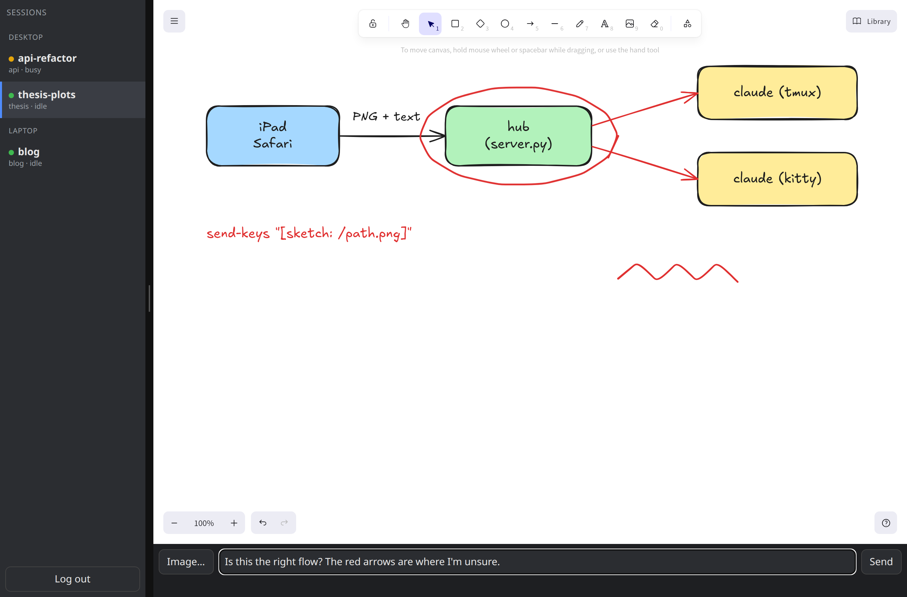
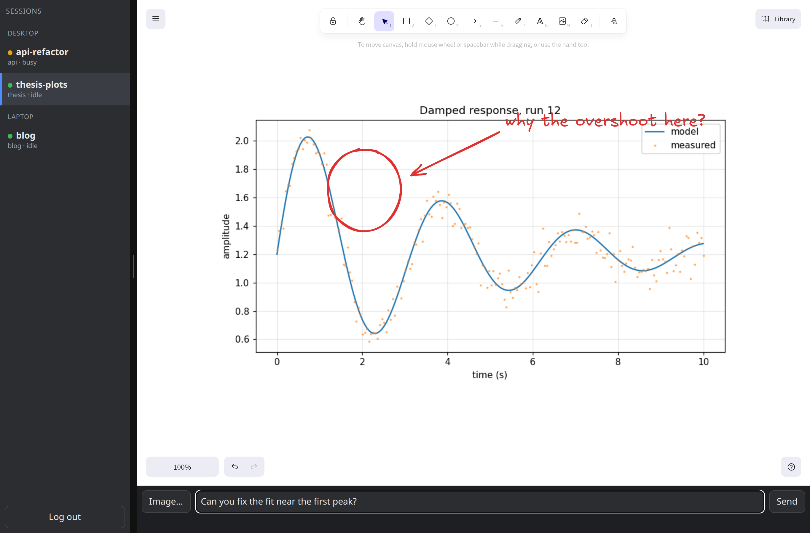
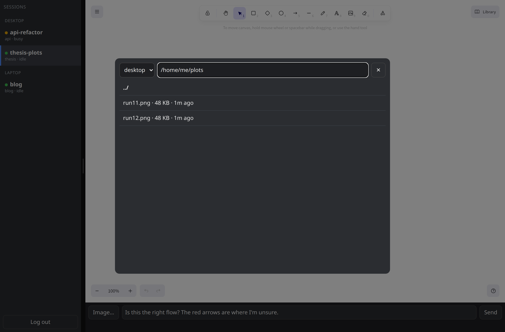

# sketchpad

Draw on an iPad (or any browser) and send the sketch straight into a running
[Claude Code](https://docs.anthropic.com/en/docs/claude-code) session.

Explaining a layout, a data flow, or "the bump on this plot" is faster with a pen than
with words. sketchpad shows your running Claude Code sessions on the left and an
[Excalidraw](https://github.com/excalidraw/excalidraw) board on the right. **Send**
exports the board to a PNG on the machine that owns the session and types
`<your message> [sketch: /path/to/sketch.png]` into that session, so Claude reads the
image on its next turn.



## Features

- **Excalidraw board**: pen with Apple Pencil pressure, shapes, arrows, text, eraser,
  undo/redo, zoom and pan. No build step: Excalidraw and React load from esm.sh.
- **Session list**: every running Claude Code session on your machines, with its
  working directory and busy/idle state. Tap one to target it.
- **Open a plot from the machine**: the **Image…** button browses folders on the
  session's machine, drops a PNG/JPEG/SVG onto the board (locked, scaled to fit), and
  you annotate on top of it. Handy for "fix this part of the figure".
- **Multiple machines**: one *hub* serves the page; *helpers* on other machines list and
  deliver to their own sessions. Sketches are saved where the session runs.
- **Login**: username/password with scrypt hashing and a signed 30-day cookie, since the
  page can type into your terminals.
- **Python standard library only** on the server side.

| Annotate a plot Claude just made | Pick an image on the session's machine |
| --- | --- |
|  |  |

## How delivery works

Claude Code writes `~/.claude/sessions/<pid>.json` for each running session. sketchpad
reads those, checks the pid is alive, and picks one of two ways in:

1. **Typed into the terminal** when the session runs in a **tmux** pane
   (`tmux send-keys`) or a **kitty** window (`kitty @ send-text`). The message arrives
   exactly as if you had typed it.
2. **Claude Code's own inbox socket** otherwise. Every session listens on a Unix socket
   (`messagingSocketPath` in its session file) with a per-session key next to it. This
   works in any terminal: VS Code, Alacritty, WezTerm, GNOME Terminal, a plain ssh
   session. Claude Code shows the message as coming from another session ("Another
   Claude session sent a message"), so the model treats it as a teammate's request
   rather than as your own typed prompt. For sketches and questions that makes no
   practical difference.

The socket is an internal Claude Code interface (present in 2.1.x). If a future
version changes it, tmux and kitty keep working.

## Requirements

- Python 3.9+ (no packages needed to run)
- Claude Code 2.1 or newer, in any terminal. Sessions inside **tmux** or **kitty** get
  the message typed in; everything else goes through the session's inbox socket.
- For kitty: add to `kitty.conf` and restart kitty

  ```
  allow_remote_control socket-only
  listen_on unix:${XDG_RUNTIME_DIR}/kitty-{kitty_pid}
  ```

- A browser on the same network. Safari on iPad with an Apple Pencil is the intended
  client, but any desktop browser works.

## Quick start (one machine)

```sh
git clone https://github.com/sagunkayastha/sketchpad
cd sketchpad
python3 server.py set-password                # creates ~/.config/sketchpad/auth.json
python3 server.py serve --bind 192.168.1.10   # your LAN address; port 8790
```

Open `http://192.168.1.10:8790` on the iPad, log in, pick a session, draw, Send.

Bind only interfaces you trust. Anyone who can log in can type into your terminals, so
don't bind `0.0.0.0` on a network you don't control. The default bind is `127.0.0.1`.

Sketches are written to `sketches/` next to `server.py` (gitignored). Nothing cleans
them up.

## Two or more machines

The hub machine serves the page and its own sessions. Each other machine runs a
*helper* (API only, same code) that the hub calls. Both sides share a token.

```sh
# on every machine, same content
mkdir -p ~/.config/sketchpad && openssl rand -hex 32 > ~/.config/sketchpad/helper-token

# helper machine (e.g. a laptop)
python3 server.py helper --bind 127.0.0.1          # port 8791

# hub machine
python3 server.py serve --bind 192.168.1.10 --remote laptop=http://127.0.0.1:8791
```

The hub reaches the helper at the URL you give. If the helper is a laptop the hub
can't reach directly, run a reverse SSH tunnel from the laptop instead:
`deploy/tunnel.sh` keeps `hub:127.0.0.1:8791` pointed at the laptop's helper
(set `SKETCHPAD_HUB` to the hub's ssh host alias).

`deploy/` has systemd user units for the hub, the helper and the tunnel, and an
optional Tailscale sidecar (`docker-compose.yml`) that exposes the hub over HTTPS on
your tailnet for use away from home. Edit the addresses in them before installing.

## Command reference

```
python3 server.py set-password              set the login (asks interactively)
python3 server.py serve  [--bind ADDR]... [--port 8790] [--remote NAME=URL]...
python3 server.py helper [--bind ADDR]... [--port 8791]
```

`--bind` and `--remote` can be repeated. A helper needs `~/.config/sketchpad/helper-token`;
the hub needs it only when `--remote` is used.

## Development

```sh
PYTHONPATH=. python3 -m unittest discover -s tests   # unit tests, stdlib only
pip install playwright && playwright install chrome
python3 tests/e2e_ui.py                              # browser test against a real hub
```

Layout:

| File | Purpose |
| --- | --- |
| `server.py` | HTTP server: hub and helper roles, routes, CLI |
| `sessions.py` | find Claude Code sessions, pick tmux pane / kitty window / inbox socket, deliver text |
| `files.py` | folder listing and image reading for the **Image…** browser |
| `auth.py` | password hashing and signed cookies |
| `static/` | the page: `index.html`, `app.js` (Excalidraw mount, session list, send), `login.html`, `style.css` |
| `deploy/` | systemd units, tunnel script, Tailscale sidecar |

## Limitations

- Outside tmux and kitty the message is framed as a peer message, not user input (see above).
- The Excalidraw eraser deletes whole elements, not parts of a stroke (upstream behaviour).
- Very large images are kept at full resolution on the board; a huge photo can make
  the iPad tab sluggish.
- Sketches accumulate on disk; delete `sketches/` when you like.

## License

MIT, see [LICENSE](LICENSE).
